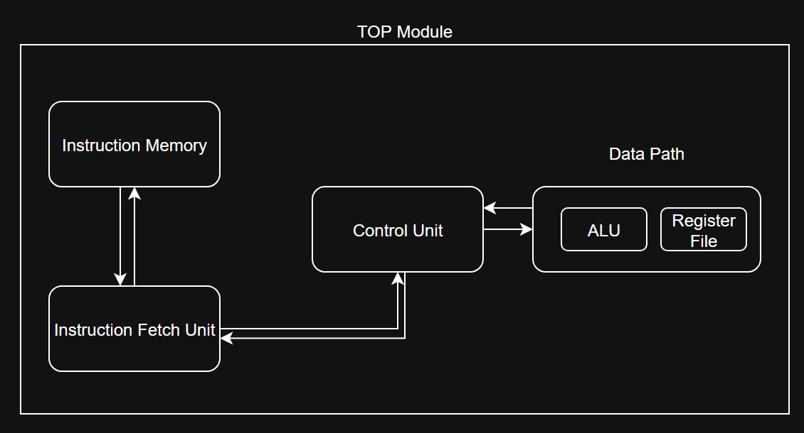

# RISC-V Processor

A single cycle RISC-V processor which impelements the RV32I base ISA.

- Support for R-type, I-type, S-type, B-type, U-type, and J-type instructions


## Basic Architecture



## Run Simulation

The processor can be simulated using the commands:

```bash
# Compile all verilog modules
iverilog -o riscv_sim tb_top_riscv.v top_riscv.v instruction_fetch_unit.v instruction_memory.v control_unit.v data_path.v register_file.v alu.v data_memory.v

# Run simulation
vvp riscv_sim
```

The simulation waveforms can be checked using
```bash
gtkwaveform riscv_processor.vcd
```

## Output

```
VCD info: dumpfile riscv_processor.vcd opened for output.
=== RISC-V Processor Execution ===
Time		PC		Instruction	Decoded
----		--		-----------	-------
26000		00000004	800100b3	            SUB
36000		00000008	00209133	            SLL
46000		0000000c	00c54ab3	            XOR
56000		00000010	00c55ab3	            SRL
66000		00000014	01bd5f33	            SRL
76000		00000018	00d67fb3	            AND
86000		0000001c	00f768b3	             OR
96000		00000020	00a08513	         I-TYPE
106000		00000024	00419313	         I-TYPE
126000		0000002c	00a12093	         I-TYPE
136000		00000030	00315093	         I-TYPE
146000		00000034	00f16093	         I-TYPE
156000		00000038	00f17093	         I-TYPE
166000		0000003c	00430283	           LOAD
176000		00000040	00732823	          STORE
186000		00000044	00410063	         BRANCH
196000		00000048	00209463	         BRANCH
206000		00000048	00209463	         BRANCH
216000		00000048	00209463	         BRANCH
226000		00000048	00209463	         BRANCH
236000		00000048	00209463	         BRANCH
246000		00000048	00209463	         BRANCH
256000		00000048	00209463	         BRANCH
266000		00000048	00209463	         BRANCH
276000		00000048	00209463	         BRANCH
286000		00000048	00209463	         BRANCH
296000		00000048	00209463	         BRANCH
306000		00000048	00209463	         BRANCH
316000		00000048	00209463	         BRANCH

=== Instruction Verification ===
Γ£ô SUB instruction (0x800100b3) executed at PC=0x04
Γ£ô SLL instruction (0x00209133) executed at PC=0x08
Γ£ô XOR instruction (0x00c54ab3) executed at PC=0x0C
Γ£ô ADDI instruction (0x00a08513) executed at PC=0x20
Γ£ô LOAD instruction (0x00430283) executed at PC=0x3C
Γ£ô STORE instruction (0x00732823) executed at PC=0x40
Γ£ô BRANCH instruction causes PC to loop at 0x48

=== Control Signals Working ===
Γ£ô ALU control signals change based on instruction type
Γ£ô Memory control signals (mem_to_reg, lb, sw) activate for load/store
Γ£ô Branch control signals (beq, bneq) activate for branch instructions
tb_top_riscv.v:55: $finish called at 316000 (1ps)
```